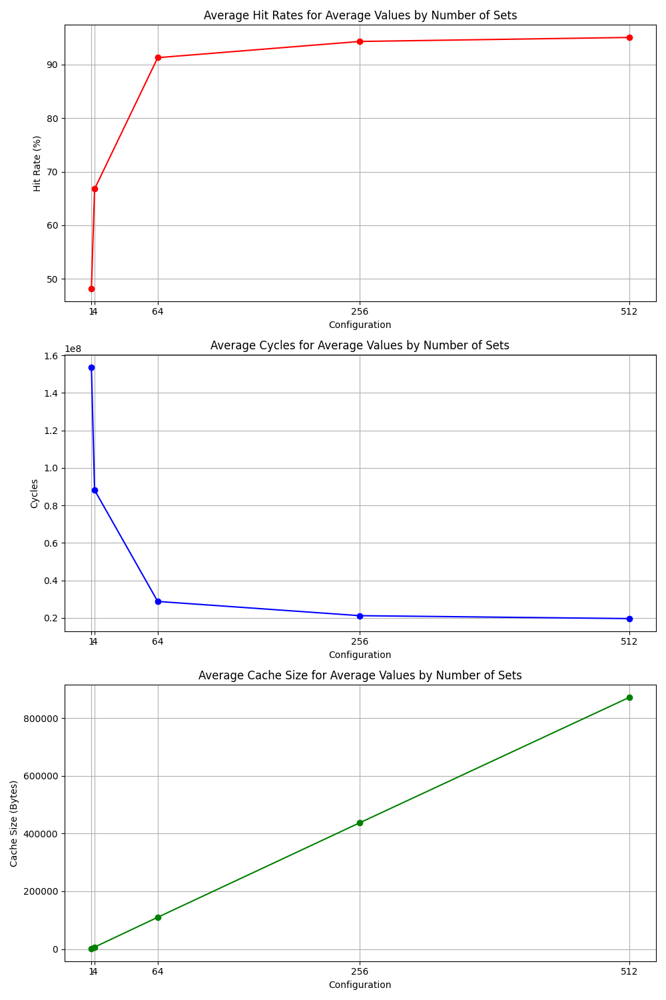
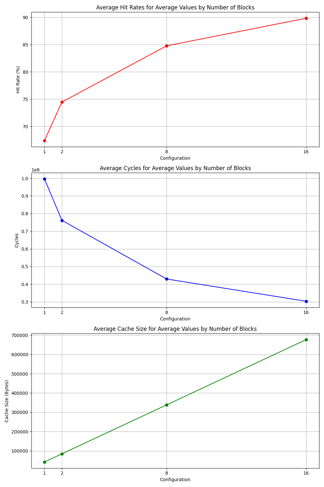
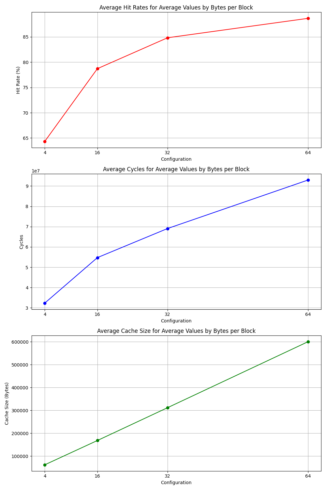
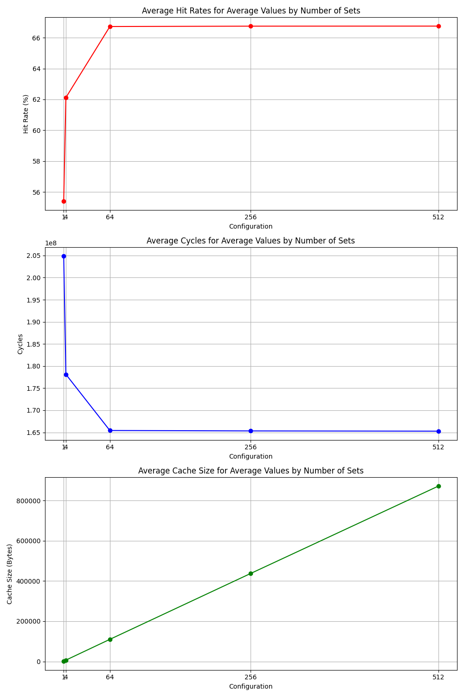
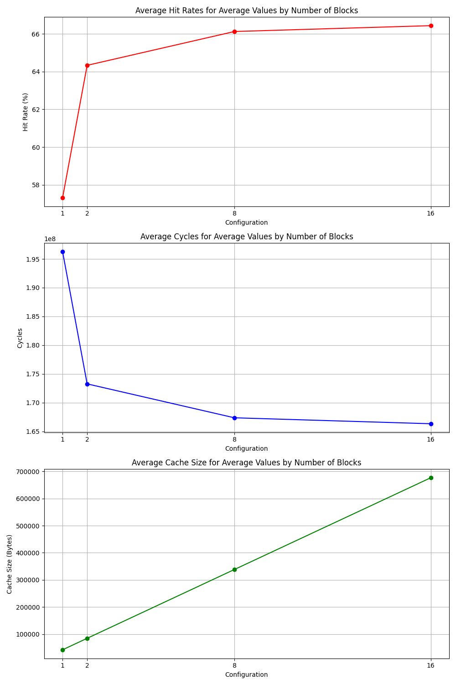
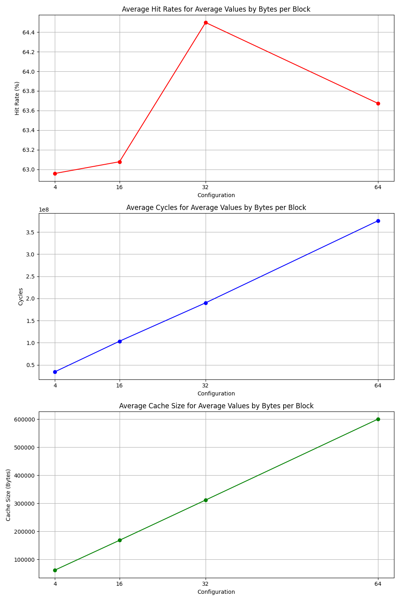

# Yash Bansal
# 2022CS51133

In the experimental phase of the program, I used two different trace files from real programs gcc.trace and gzip.trace available openly on the following github link :-
https://github.com/Asmita-Zjigyasu/Direct-Mapped-Cache-implementation-in-Cpp/blob/main

## General results and conclusions

By the generated graphs for average values and taking other factors into account as discussed below, the following conclusions are derived:-

1. The most efficient number of sets in the cache is 128, as after that as can be seen in the graphs, the rise in hit rate and the drop in total number of cycles is very less, but the rise is cache size is very high. Thus, 64/128 as the most efficient number of sets in the cache.
2. The most efficient number of blocks in a set are 4/8, as again after these many blocks, the hit rates does not increase much, but the cache size increases very rapidly with increasing number of blocks.
3. The most effective number of bytes per block is 32 i.e. 4 words per cache line. Before this, the effect of spatial locality is very low, as after this, the block gets replaces too often, and also the number of cycles increases very much for > 32 bytes per block. Thus, 32 is the most effective number of bytes.
4. The write-allocate policy is more effective than no-write-allocate policy, as the hit rate is higher in the write-allocate policy, and the number of cycles also does not have much difference in both.
5. Their is not much difference between write-back and write-through cache policies, in the hit rate, also for the number of cycles used. Still, write-through is marginally better than write-back for the test cases used.
6. The LRU eviction method is slightly better than FIFO eviction method, both in terms of hit rate and the number of cycles used.

## Test Case 1 results

For each dictionary, the key denotes the value of the parameter for which the average values are calculated, the second element of values list denotes average hit rate, 3rd denotes average number of cycles, and 4th denotes average cache size

Average values by parameter:

Number of Sets: {'1': [1.0, 48.16476199202483, 153596595.82291666, 1762.3125], '4': [1.0, 66.76626960425949, 88182391.57291667, 6995.25], '64': [1.0, 91.296179047981, 28771070.822916668, 110196.0], '256': [1.0, 94.32121655487316, 21180645.885416668, 437328.0], '512': [1.0, 95.07035249045117, 19621854.65625, 871200.0]}

Number of Blocks: {'1': [1.0, 67.41119382773265, 99623394.8, 42295.75], '2': [1.0, 74.4720319136627, 76172813.6, 84591.5], '8': [1.0, 84.77418782469071, 42952691.608333334, 338366.0], '16': [1.0, 89.83761018558553, 30333147.0, 676732.0]}

Bytes per Block: {'4': [1.0, 64.32761179510152, 32328747.691666666, 62048.7], '16': [1.0, 78.70494567398964, 54737203.18333333, 168264.0], '32': [1.0, 84.81371792360808, 69071581.0, 311767.65], '64': [1.0, 88.64874835897238, 92944515.13333334, 599904.9]}

Write Allocation Policy: {'no-write-allocate': [1.0, 75.476678502103, 53967288.00625, 285119.6625], 'write-allocate': [1.0, 80.94729465582544, 66422123.625, 285684.6375]}

Write Back or Through Policy: {'write-back': [1.0, 80.9472946558253, 66062309.25, 286249.6125], 'write-through': [1.0, 78.2119865789642, 60374613.003125, 285119.6625]}

LRU or FIFO Policy: {'lru': [1.0, 79.41285311583538, 61332182.84583333, 285496.3125], 'fifo': [1.0, 78.83465876000054, 63208840.65833333, 285496.3125]}

Top 5 Hit Rates:

Hit Rate: 99.35% - Cache Size: 4349952B - Sets: 512, Blocks: 16, Bytes: 64, Write1: write-allocate, Write2: write-back, Policy: lru

Hit Rate: 99.35% - Cache Size: 4341760B - Sets: 512, Blocks: 16, Bytes: 64, Write1: write-allocate, Write2: write-through, Policy: lru

Hit Rate: 99.35% - Cache Size: 4349952B - Sets: 512, Blocks: 16, Bytes: 64, Write1: write-allocate, Write2: write-back, Policy: fifo

Hit Rate: 99.35% - Cache Size: 4341760B - Sets: 512, Blocks: 16, Bytes: 64, Write1: write-allocate, Write2: write-through, Policy: fifo

Hit Rate: 99.35% - Cache Size: 2179072B - Sets: 256, Blocks: 16, Bytes: 64, Write1: write-allocate, Write2: write-back, Policy: lru

Top 5 Minimum Cycles:

Total Cycles: 5394883 - Cache Size: 2260992B - Sets: 512, Blocks: 16, Bytes: 32, Write1: write-allocate, Write2: write-back, Policy: lru

Total Cycles: 5402083 - Cache Size: 2260992B - Sets: 512, Blocks: 16, Bytes: 32, Write1: write-allocate, Write2: write-back, Policy: fifo

Total Cycles: 5923283 - Cache Size: 1220608B - Sets: 512, Blocks: 16, Bytes: 16, Write1: write-allocate, Write2: write-back, Policy: lru

Total Cycles: 5946083 - Cache Size: 450560B - Sets: 512, Blocks: 16, Bytes: 4, Write1: write-allocate, Write2: write-back, Policy: lru

Total Cycles: 5947683 - Cache Size: 4349952B - Sets: 512, Blocks: 16, Bytes: 64, Write1: write-allocate, Write2: write-back, Policy: lru

 
 

 
 

## Test Case 2 results

Average values by parameter:

Number of Sets: {'1': [1.0, 55.40554545599429, 204861556.72916666, 1762.3125], '4': [1.0, 62.1215284707151, 178118733.85416666, 6995.25], '64': [1.0, 66.72711245402358, 165425525.45833334, 110196.0], '256': [1.0, 66.750001039406, 165330145.72916666, 437328.0], '512': [1.0, 66.75412618180462, 165276652.07291666, 871200.0]}

Number of Blocks: {'1': [1.0, 57.31885579420318, 196260171.38333333, 42295.75], '2': [1.0, 64.3306173655632, 173262437.3, 84591.5], '8': [1.0, 66.12323924630599, 167361170.08333334, 338366.0], '16': [1.0, 66.43393847548255, 166326312.30833334, 676732.0]}

Bytes per Block: {'4': [1.0, 62.957653908304934, 34310844.275, 62048.7], '16': [1.0, 63.07713708794492, 103403988.00833334, 168264.0], '32': [1.0, 64.4984623721184, 190121654.53333333, 311767.65], '64': [1.0, 63.67339751318662, 375373604.2583333, 599904.9]}

Write Allocation Policy: {'no-write-allocate': [1.0, 63.493192670524934, 142522494.68125, 285119.6625], 'write-allocate': [1.0, 63.58089774532061, 192442536.8125, 285684.6375]}

Write Back or Through Policy: {'write-back': [1.0, 63.58089774532057, 242202680.875, 286249.6125], 'write-through': [1.0, 63.5370452079228, 142602443.715625, 285119.6625]}

LRU or FIFO Policy: {'lru': [1.0, 64.35162202764543, 173180895.39166668, 285496.3125], 'fifo': [1.0, 62.75170341313196, 178424150.14583334, 285496.3125]}

Top 10 Hit Rates:

Hit Rate: 66.85% - Cache Size: 546816B - Sets: 64, Blocks: 16, Bytes: 64, Write1: write-allocate, Write2: write-back, Policy: lru

Hit Rate: 66.85% - Cache Size: 546816B - Sets: 64, Blocks: 16, Bytes: 64, Write1: write-allocate, Write2: write-back, Policy: fifo

Hit Rate: 66.85% - Cache Size: 545792B - Sets: 64, Blocks: 16, Bytes: 64, Write1: write-allocate, Write2: write-through, Policy: lru

Hit Rate: 66.85% - Cache Size: 545792B - Sets: 64, Blocks: 16, Bytes: 64, Write1: write-allocate, Write2: write-through, Policy: fifo

Hit Rate: 66.85% - Cache Size: 1089536B - Sets: 256, Blocks: 8, Bytes: 64, Write1: write-allocate, Write2: write-back, Policy: lru

Top 10 Minimum Cycles:

Total Cycles: 32419744 - Cache Size: 450560B - Sets: 512, Blocks: 16, Bytes: 4, Write1: write-allocate, Write2: write-back, Policy: lru

Total Cycles: 32419744 - Cache Size: 450560B - Sets: 512, Blocks: 16, Bytes: 4, Write1: write-allocate, Write2: write-back, Policy: fifo

Total Cycles: 32424544 - Cache Size: 229376B - Sets: 256, Blocks: 16, Bytes: 4, Write1: write-allocate, Write2: write-back, Policy: lru

Total Cycles: 32424544 - Cache Size: 229376B - Sets: 256, Blocks: 16, Bytes: 4, Write1: write-allocate, Write2: write-back, Policy: fifo

Total Cycles: 32424544 - Cache Size: 225280B - Sets: 512, Blocks: 8, Bytes: 4, Write1: write-allocate, Write2: write-back, Policy: lru

 
 

 
 

## Memory leak report

The following are valgrind outputs for different configurations, which shows no memory leak in the code:-

./csim2 256 4 16 write-allocate write-through fifo < leak.txt

total heap usage: 7,184 allocs, 7,184 frees, 311,799 bytes allocated

All heap blocks were freed -- no leaks are possible

./csim2 256 4 16 write-allocate write-through lru < leak.txt

total heap usage: 8,183 allocs, 8,183 frees, 338,296 bytes allocated

All heap blocks were freed -- no leaks are possible

./csim2 256 4 16 write-allocate write-back fifo < leak.txt

total heap usage: 7,184 allocs, 7,184 frees, 311,799 bytes allocated

All heap blocks were freed -- no leaks are possible

./csim2 256 4 16 write-allocate write-back lru < leak.txt

total heap usage: 8,183 allocs, 8,183 frees, 338,296 bytes allocated

All heap blocks were freed -- no leaks are possible

./csim2 256 4 16 no-write-allocate write-through fifo < leak.txt

total heap usage: 6,990 allocs, 6,990 frees, 307,375 bytes allocated

All heap blocks were freed -- no leaks are possible

./csim2 256 4 16 no-write-allocate write-through lru < leak.txt

total heap usage: 7,845 allocs, 7,845 frees, 330,746 bytes allocated

All heap blocks were freed -- no leaks are possible

./csim2 256 4 16 no-write-allocate write-back fifo < leak.txt

total heap usage: 6,990 allocs, 6,990 frees, 307,375 bytes allocated

All heap blocks were freed -- no leaks are possible

./csim2 256 4 16 no-write-allocate write-back lru < leak.txt

total heap usage: 7,845 allocs, 7,845 frees, 330,746 bytes allocated

All heap blocks were freed -- no leaks are possible