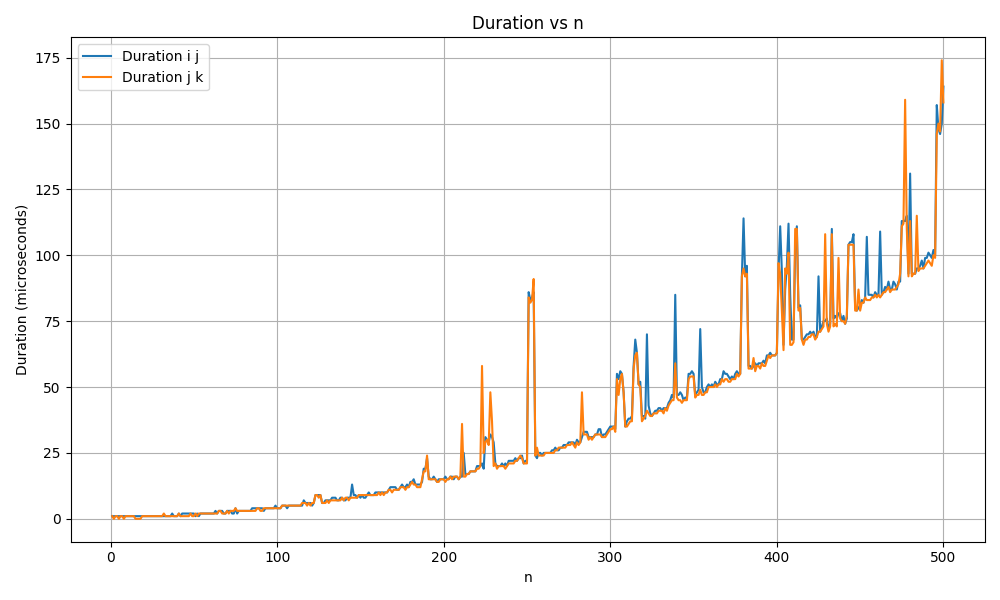
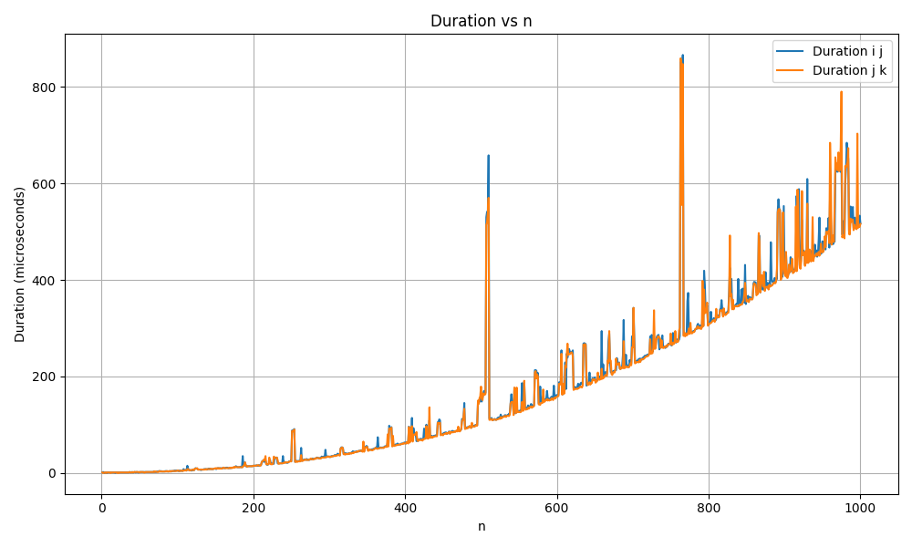

# Yash Bansal
# 2022CS51133

## Cache experiment

In this aassignment, we have experimented different matrix operations over matrices of different sizes to test the cache parameters of the computer. The experiments are done by changing the loop order of the multiply and transpose operations, as by changing the loop order, the accesses get changed from linear in an array to accessing different arrays, which can be affected depending on the cache parameters. 

## Result from Matrix Multiplication operations

I have used 6 different loop orders (ijk, jik, kij, kji, ikj, jik), but out of these 6 loop orders, 3 become redundant, in the way that overall memory accesses are occuring to be similar, as can be seen from the image.

<figure>
  
  <figcaption>Plot to show redundancy in loop orders</figcaption>
</figure>

After removing the redundant loop orders, the remaining 3 loop order durations are plotted again different n values from 1 to a particular n. The graphs are as follows.

   

   

   

From these plots, the parameters of the cache can be estimated. Firstly, there are high jumps in the time taken for particular values of n :- 256, 512, 1024. There is a significant high amount of time taken for these values of n, which could indicate the number of blocks in a set in the cache, for different cache levels. This is estimated by taking into account the spatial locality of the cache. 

The high fluctuations for higher values of n could indicate the overall cache size, as when complete matrix gets stored in the cache, loads and store take fluctuation amounts of time, as multiple matrices are accesses at the same time.

## Results from In Place matrix Transpose operations

The following are the graphs generated for the two loop orders of the operation.

   

   

   

## Results from matrix Transpose operation using an additional matrix

The following are the graphs generated for the two loop orders of the operation.

   

   

   

